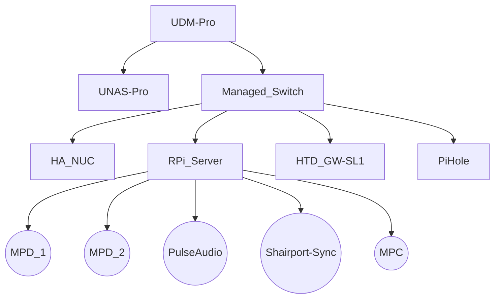

# High level overview of system configuration.

The network is separated into several VLANs to segregate IoT devices, etc.

#### 1. UDM-Pro: Network Controller, DHCP, Firewall  
#### 2. UNAS-Pro: Network Storage  
#### 3. HA-NUC: NUC running HomeAssistant on bare metal  
  * _Home Assistant can SSH into the RPi_Server via SSH Key for monitoring and commands_
#### 4. RPi_Server: Headless Rasberry Pi 4 used mostely for audio processing  
  * MOD_1: [MPD](https://www.musicpd.org/) running in system mode on port 6600 (used for general audio output going to whole house [Home Theater Direct](www.htd.com) sound system).
  * MOD_2: MPD running in system mode on port 6601 (used for making announcements with output going to while house sound system)
  * MPC: [MPC](https://www.musicpd.org/clients/mpc/) running in system mode to provide command line and ssh control of the MPD instances
  * [PulseAudio](https://www.freedesktop.org/wiki/Software/PulseAudio): Used to control the volue of individual applications running on the RPi_Server, particluary Shairport-Sync)
  * [Shairport-Sync](https://github.com/mikebrady/shairport-sync): Used to Stream AirPlay2 from iDevices to whole house sound system
#### 5. PiHole: Headless Rasberry Pi 4 running [PiHole](https://pi-hole.net/) 

